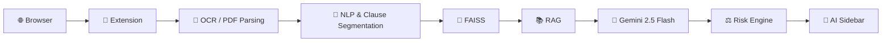

# ⚖️ CLARA

### Clause-Level Analysis & Risk Assessment Engine

> **Understand the clause. See the risk. Decide with context.**

CLARA is a **browser-integrated Legal Intelligence Platform** that analyzes contracts, Terms & Conditions, policies, and legal notices at the **clause level**.

It combines **OCR, NLP, RAG, vector search, and LLM reasoning** to provide contextual and explainable legal risk insights directly within the user's workflow.

---

## ✨ Features

* 🌐 **Browser-Native Analysis** — Analyze documents directly in the browser
* 🧩 **Clause-Level Analysis** — Identify and analyze individual clauses
* ⚠️ **Risk Assessment** — Highlight potentially concerning terms
* ⚖️ **Compliance Validation** — Apply rule-based regulatory checks
* 💰 **Financial Clause Detection** — Identify potentially unfavorable financial terms
* ⏰ **Obligation & Deadline Extraction** — Detect important responsibilities and deadlines
* 💬 **Document-Grounded Q&A** — Ask questions based on the document
* 🔍 **Explainable Results** — Understand why a clause requires attention

---

## 🔄 How It Works

```text
📄 Document
    ↓
🔍 OCR / PDF Parsing
    ↓
🧩 Clause Segmentation
    ↓
🧠 Embeddings
    ↓
🔎 FAISS Retrieval
    ↓
📚 RAG + Gemini
    ↓
⚖️ Risk & Compliance Analysis
    ↓
💬 Interactive AI Sidebar
```

---

## 🏗️ Architecture



---

## 🛠️ Tech Stack

| Layer               | Technologies                     |
| ------------------- | -------------------------------- |
| Frontend            | React.js, Tailwind CSS           |
| Extension           | Chrome Manifest V3               |
| Backend             | FastAPI, PostgreSQL              |
| AI                  | Gemini 2.5 Flash, LangChain, RAG |
| NLP                 | spaCy, Sentence Transformers     |
| Document Processing | PaddleOCR, PyMuPDF               |
| Vector Search       | FAISS                            |
| Deployment          | Docker                           |

---

## 🎯 Applications

**Contracts · Terms & Conditions · Privacy Policies · Loan & Insurance Documents · Legal Notices · Enterprise Compliance**

---

## 🔮 Future Enhancements

* 🌍 Multilingual & jurisdiction-based analysis
* 📑 Contract comparison
* 📱 Mobile integration
* 📊 Compliance dashboards
* ⛓️ Blockchain verification

---

## 📸 Screenshots


---


## ⚖️ Disclaimer

CLARA is an **AI-assisted legal analysis tool** intended to support document understanding and risk identification. It does not replace qualified legal advice, especially for high-stakes legal decisions.

---


### CLARA

**From dense legal language → to explainable intelligence.**

